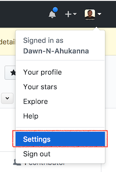
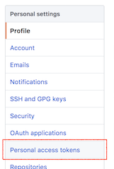
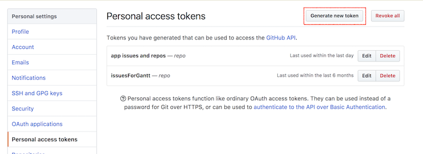
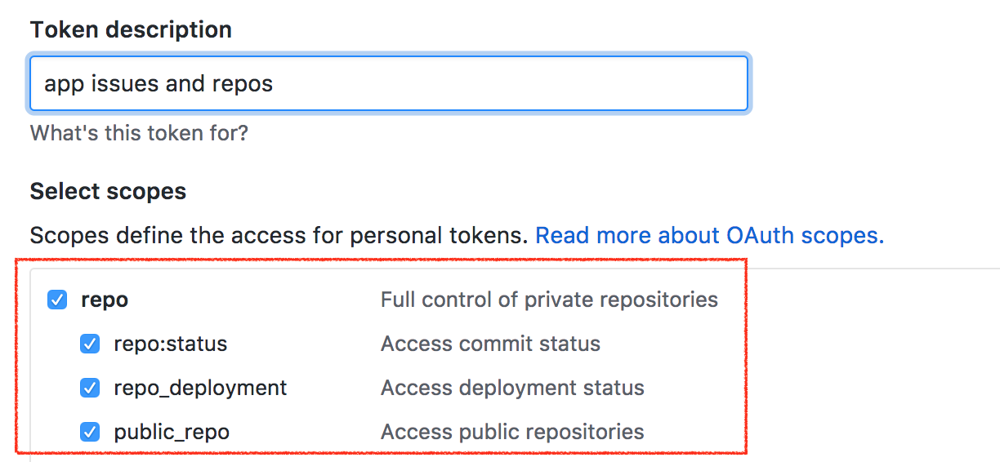
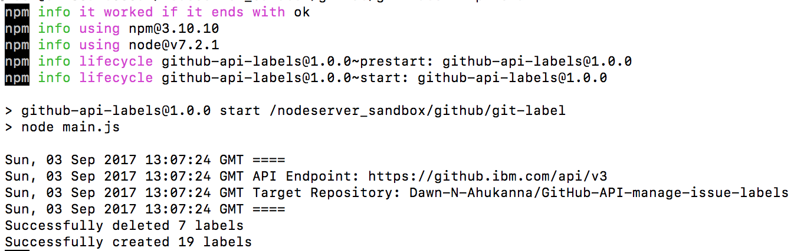
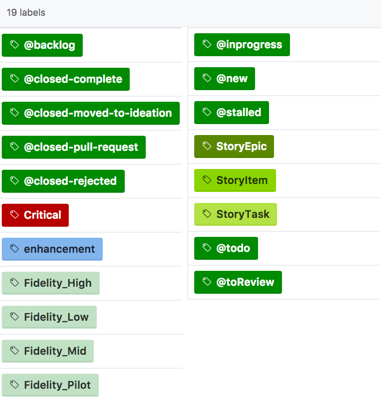
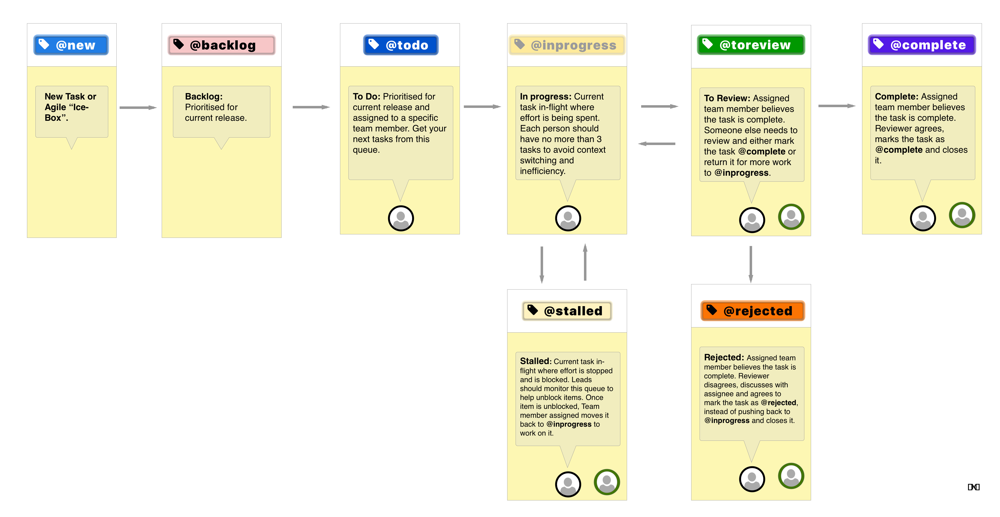

# Manage issue labels with GitHub API
Use GitHub Enterprise API with Personal Access Token to manage issue labels.

# Contents
* Usage
  * [Create Personal Access Token](#create-personal-access-token)
  * [Configure the Project with your Personal Access Token](#configure-the-project-with-your-personal-access-token)
  * [Run the Project](#run-the-project)
* [Files](#files)
* [Dependencies](#dependencies)
----

# Usage
## Create Personal Access Token
1. Go to your **Settings** menu option under your profile menu.
> 

2. Select the **Personal Access Token** menu.
> 

3. On the Personal Access Token page, select "Generate new token" button.
> 

4. Select the repository settings and make a note of the API key.
> 
> DO NOT store this variable in the Git Repo, as it will give anyone API access to repositories you have access to.

## Configure the Project with your Personal Access Token
1.) Clone this repository.

2.) `cd` into the directory.
Edit `main.js` to:
* Add your target repository on line 121 -
> ```javascript
> var targetRepo='[Insert your repository here]';
> ```

* Add your Personal Access Token on line 131 -
>```javascript
> var personalAccessToken='[Insert your Personal Access Token here]';
> ```

The following objects define labels -
* Default Github repo labels that will be removed, are defined on line 4 -
> ```javascript
> var labelsRepoDefault
> ```

* Default KanBan labels that will be added on line 37 -
> ```javascript
> var labelsRepoKanban
> ```

## Run the Project
3.) Install NodeJs and npm  
    * Install/ensure you're running the right version of Node/npm.  
    * Install [Node Version Manager](https://github.com/creationix/nvm) and run `nvm use`. Or install the NodeJs version number in `.nvmrc` file, which currently is `7.2.1`.

4.) Run `npm install` to install dependencies.  

5.) Run `npm start` to create the labels in your configured repository. See screenshot below for sample output after running the command.
>   

6.) Labels created shown in the following image -  
> 


# Files
* `main.js` - Entrypoint for the application.
> `var labelsRepoDefault` defines the default labels for a GitHub Repo.  
> `var labelsCode` defines the Kanban project labels for this workflow, shown below
> 

# Dependencies
* [git-label npm module](https://www.npmjs.com/package/git-label) with [GitHub source code](https://github.com/jasonbellamy/git-label).

# License
Copyright (c) 2017 Dawn Ahukanna
Licensed under the MIT license.
